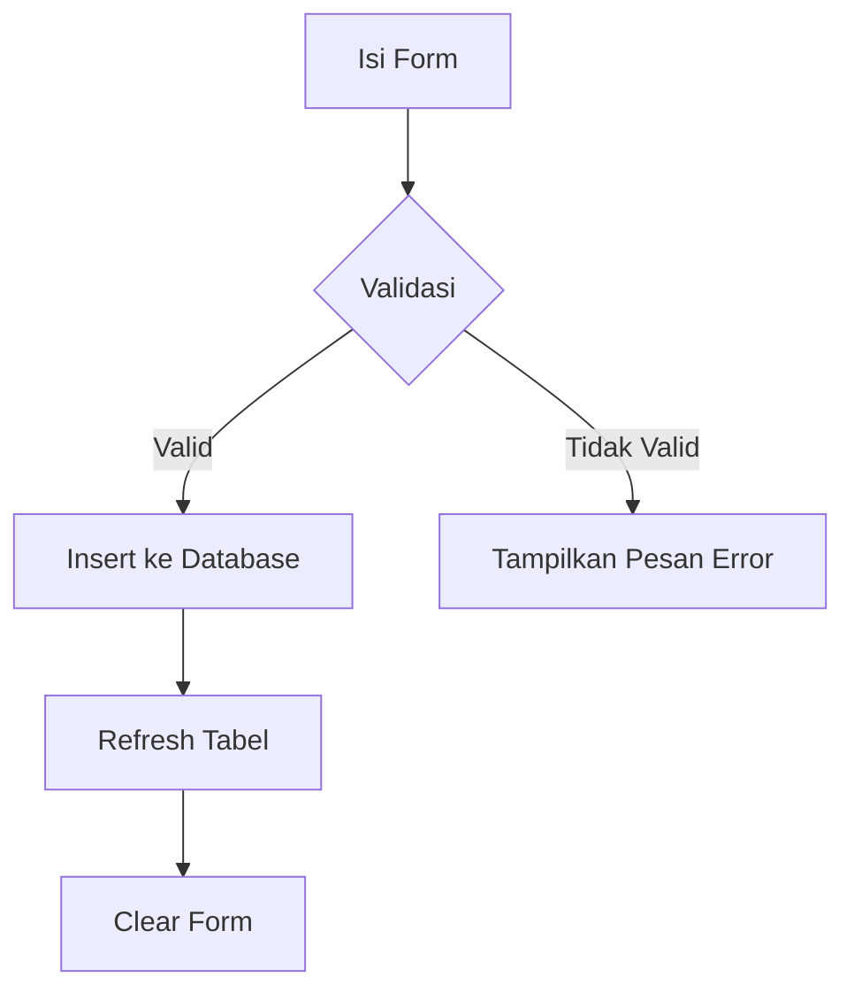
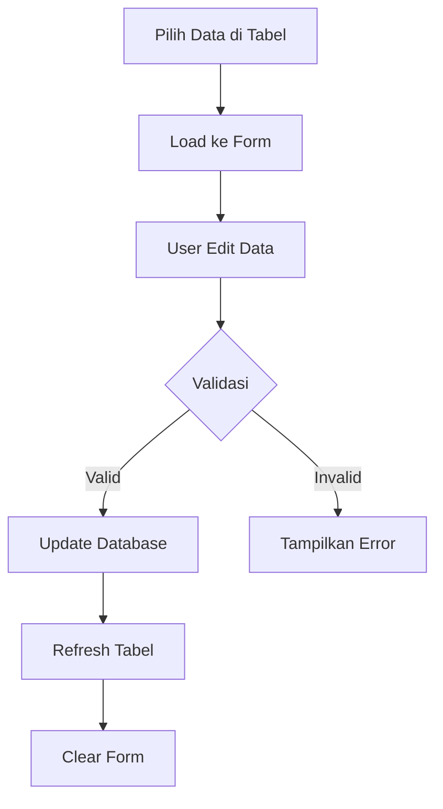
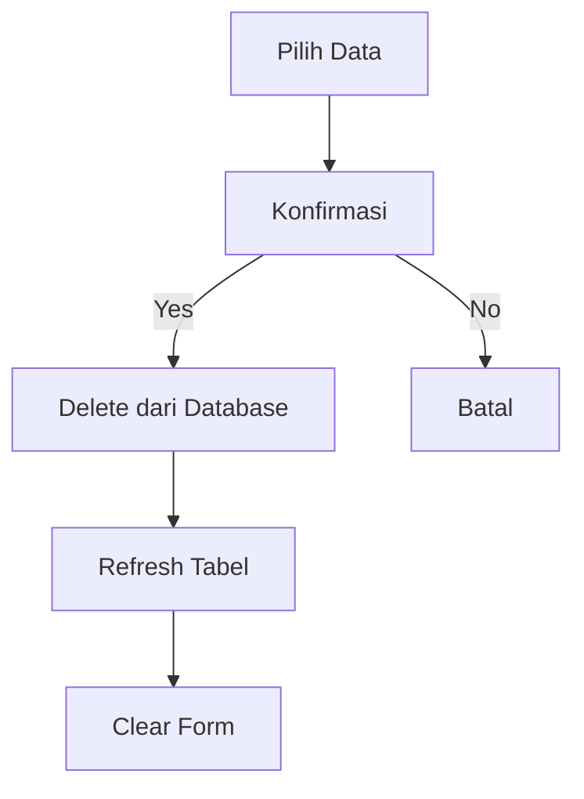
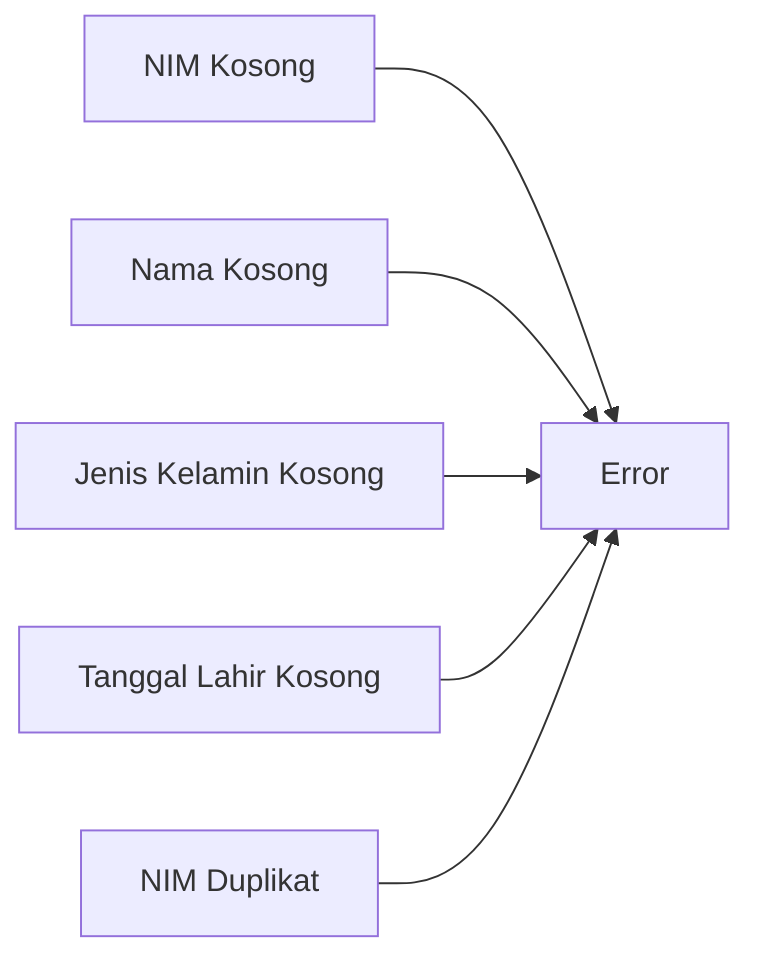
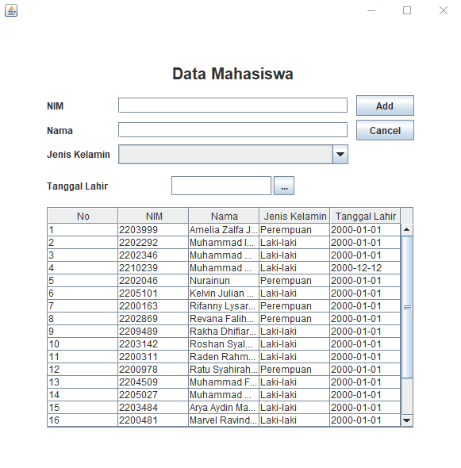

# Janji
Saya Zakiyah Hasanah dengan NIM 2305274 mengerjakan Tugas Praktikum 5 dalam mata kuliah Desain dan Pemrograman Berorientasi Objek untuk keberkahanNya maka saya tidak melakukan kecurangan seperti yang telah dispesifikasikan.

# Desain Program
Program ini adalah aplikasi sederhana untuk mengelola data mahasiswa menggunakan Java Swing. Aplikasi ini memungkinkan pengguna untuk menambah, mengupdate, dan menghapus data mahasiswa dengan validasi input yang ketat. Data mahasiswa yang disimpan meliputi:
- NIM (wajib diisi, harus unik)
- Nama (wajib diisi)
- Jenis kelamin (wajib dipilih)
- Tanggal lahir (wajib diisi)

Program ini menggunakan GUI (Graphical User Interface) untuk memudahkan interaksi pengguna dan database MySQL untuk penyimpanan data.

### Penjelasan Class
* **Mahasiswa.java** - Kelas ini merepresentasikan entitas mahasiswa dengan atribut NIM, nama, jenis kelamin, dan tanggal lahir. Kelas ini menyediakan getter dan setter untuk setiap atribut.
* **Menu.java** - Kelas antarmuka utama yang berisi komponen GUI dan logika aplikasi. Menggunakan:
  - Text field untuk NIM dan nama
  - Combo box untuk jenis kelamin (opsi: "", "Laki-laki", "Perempuan")
  - DatePicker untuk memilih tanggal lahir (wajib diisi)
  - Tabel untuk menampilkan data
  - Tombol untuk Add/Update, Delete, dan Cancel
* **Database.java** - Kelas yang menangani koneksi dan operasi database MySQL.

### Fitur Program dengan Validasi
1. **Tambah Data** 
   - Semua field wajib diisi
   - NIM harus unik (tidak boleh duplikat)
   - Jenis kelamin harus dipilih (tidak boleh kosong)
   - Tanggal lahir wajib dipilih

2. **Update Data** 
   - Semua field wajib diisi
   - Validasi sama seperti tambah data (kecuali pengecekan unik NIM)

3. **Hapus Data** 
   - Konfirmasi dialog sebelum menghapus
   - Hanya bisa menghapus data yang dipilih di tabel

4. **Clear Form** 
   - Mengosongkan semua field
   - Mereset DatePicker
   - Mengembalikan tombol "Update" ke "Add"

# Penjelasan Alur
### 1. **Inisialisasi Program** 
   - Membuka koneksi database
   - Memuat data mahasiswa ke tabel
   - Menyiapkan form input

### 2. **Menambah Data**

### 3. **Mengupdate Data**

  Proteksi:
  - Harus memilih data terlebih dahulu
  - Konfirmasi popup muncul sebelum hapus
  - Notifikasi setelah berhasil dihapus

### 4. **Menghapus Data**

Proteksi:
- Harus memilih data terlebih dahulu
- Konfirmasi popup muncul sebelum hapus
- Notifikasi setelah berhasil dihapus

### 5. **Validasi Input**

# Dokumentasi

