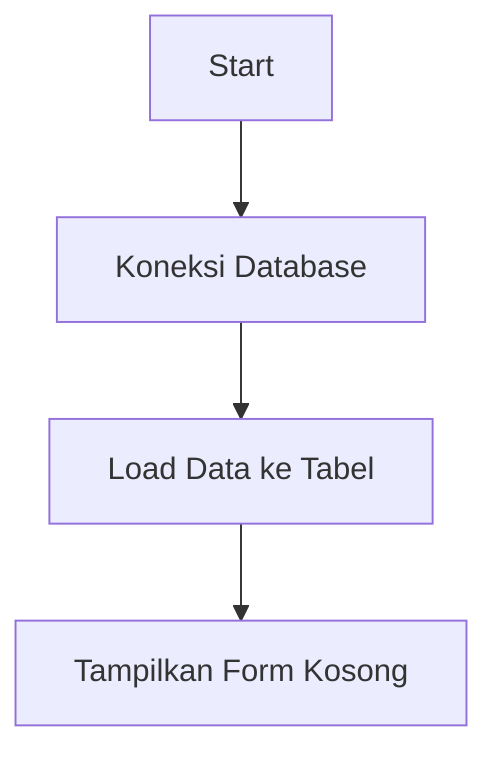
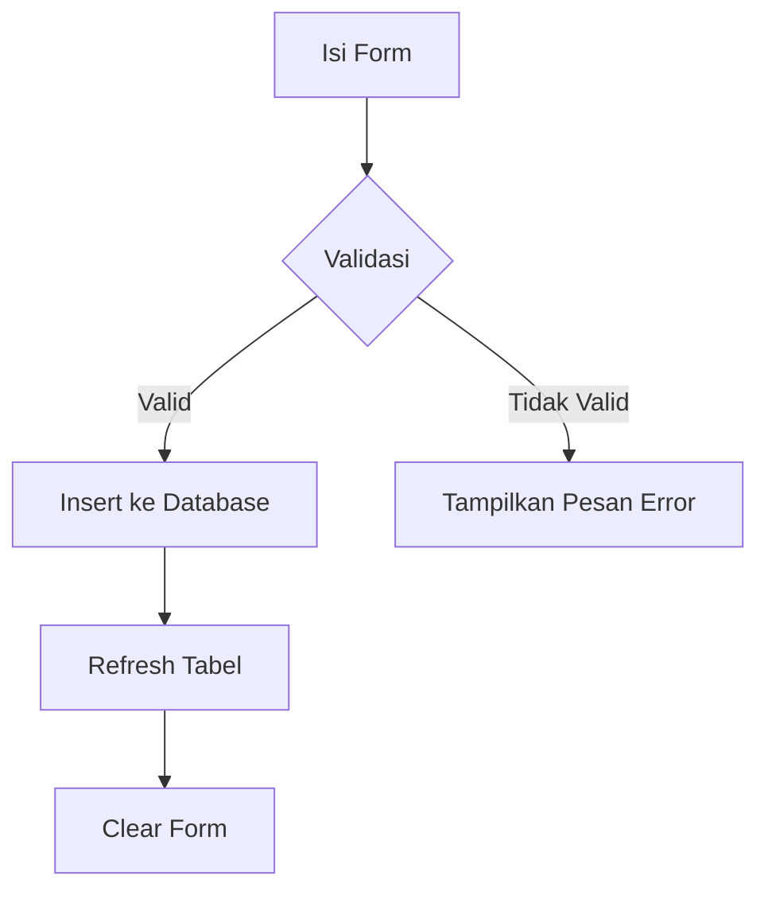
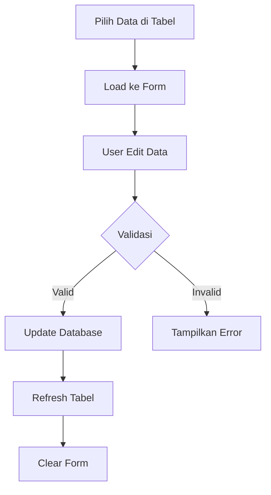
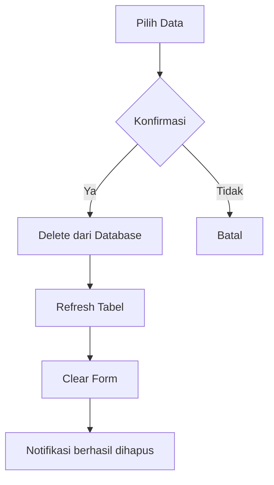
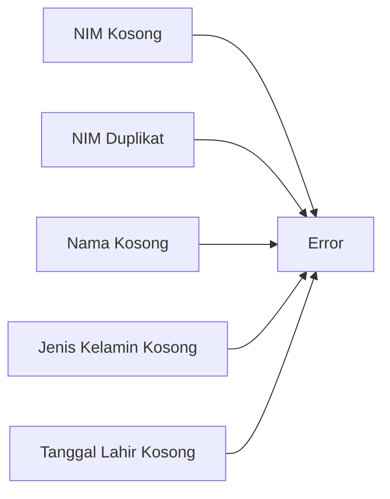

# Janji
Saya Zakiyah Hasanah dengan NIM 2305274 mengerjakan Tugas Praktikum 5 dalam mata kuliah Desain dan Pemrograman Berorientasi Objek untuk keberkahanNya maka saya tidak melakukan kecurangan seperti yang telah dispesifikasikan.

# Desain Program
Program ini adalah aplikasi sederhana untuk mengelola data mahasiswa menggunakan Java Swing GUI dan database MySQL untuk penyimpanan data. Aplikasi ini memungkinkan pengguna untuk menambah, mengupdate, dan menghapus data mahasiswa dengan validasi input. Data mahasiswa yang disimpan meliputi:
- NIM (harus diisi, harus unik)
- Nama (harus diisi)
- Jenis kelamin (harus dipilih)
- Tanggal lahir (harus diisi)

### Fitur Program dengan Validasi
1. **Tambah Data** 
   - Semua field harus diisi
   - NIM harus unik (tidak boleh duplikat)
   - Jenis kelamin harus dipilih (tidak boleh kosong)
   - Tanggal lahir harus dipilih

2. **Update Data** 
   - Semua field harus diisi
   - Validasi sama seperti tambah data (kecuali pengecekan unik NIM, karena field NIM dikunci)

3. **Hapus Data** 
   - Konfirmasi dialog sebelum menghapus
   - Hanya bisa menghapus data yang dipilih di tabel

4. **Clear Form** 
   - Mengosongkan semua field
   - Mereset DatePicker
   - Mematikan tombol "Update" dan "Delete", serta menyalakan tombol "Add"

### Penjelasan Class
* **Mahasiswa.java** - Kelas ini merepresentasikan entitas mahasiswa dengan atribut NIM, nama, jenis kelamin, dan tanggal lahir. Kelas ini menyediakan getter dan setter untuk setiap atribut.
* **Menu.java** - Kelas antarmuka utama yang berisi komponen GUI dan logika aplikasi. Menggunakan:
  - Text field untuk NIM dan nama
  - Combo box untuk jenis kelamin (opsi: "", "Laki-laki", "Perempuan")
  - DatePicker untuk memilih tanggal lahir (harus diisi)
  - Tabel untuk menampilkan data
  - Tombol untuk Add/Update, Delete, dan Cancel
* **Database.java** - Kelas yang menangani koneksi dan operasi database MySQL.

# Penjelasan Alur
### 1. **Inisialisasi Program** 

### 2. **Menambah Data**

### 3. **Mengupdate Data**

### 4. **Menghapus Data**

### 5. **Validasi Input**

# Dokumentasi

